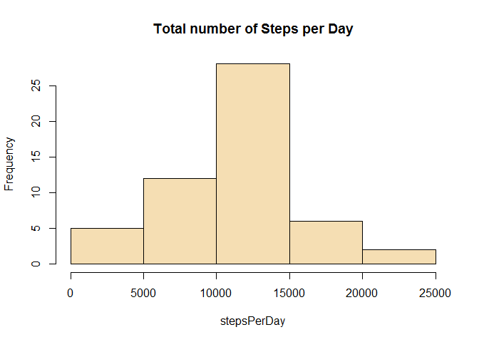
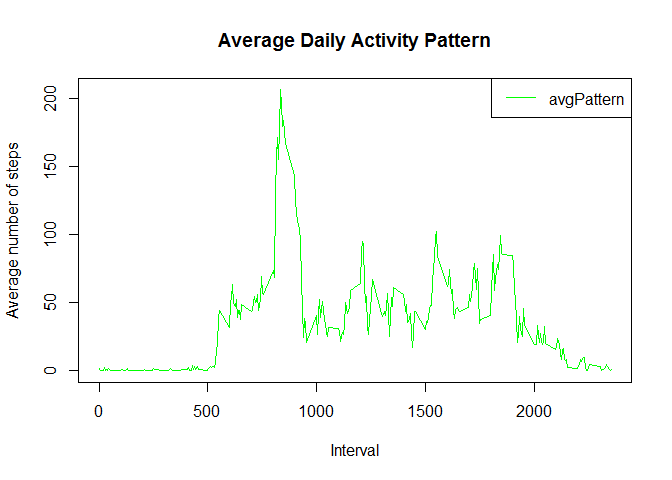
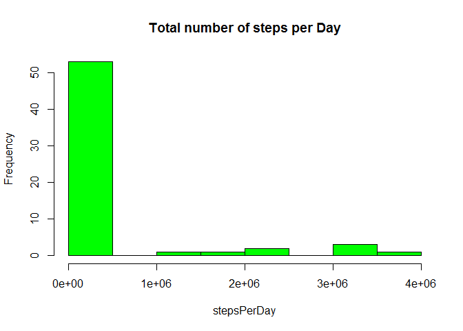
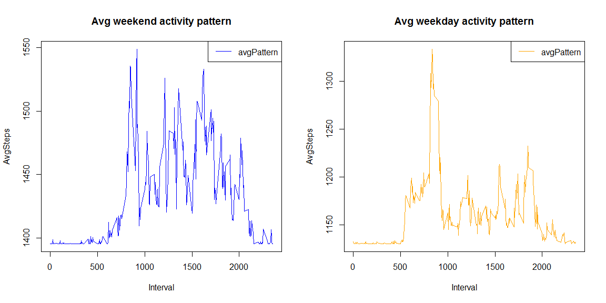

# Reproducible Research: Peer Assessment 1

## 0. Setup
The packages and functions required to run this code are:


packageName   functions                                               
------------  --------------------------------------------------------
stats         aggregate, median                                       
base          plot, hist, with, which, max, cat, mean, summary, is.na 
utils         download.file, read.csv                                 
knitr         kable                                                   

You can check if you have those packages in your R installation using the command ```library(packageName)```, if you get an error with the message: __there is no package called...__, then you can install the missing packages using the command ```install.packages('packageName')```

To run the reproducible code, you need to have the  __activity.csv__ file into your work directory, you can download the file with the code from this repository or alternatively you can, download and unzip the data into your own directory folder with the following command:


```r
url <- 'https://d396qusza40orc.cloudfront.net/repdata%2Fdata%2Factivity.zip'
download.file(url,"./activity.zip")
activityData <- read.csv(unzip("activity.zip"), sep = ",", header = TRUE)
```
__* Note: __ This code was created under __R version 3.4.0__ using __RStudio version 1.0.143__

## 1. Loading and preprocessing the data
In this section we unzipped the data and transform the column __date__ into a date format (this will be useful in the next sections).


```r
activityData <- read.csv("activity.csv", sep = ",", header = TRUE)
activityData$date <- as.character(activityData$date)
activityData$date <- as.Date(activityData$date, "%Y-%m-%d")

activityData$date <- as.character(activityData$date)
activityData$date <- as.Date(activityData$date, "%Y-%m-%d")
```


## 2. What is mean total number of steps taken per day?
#### 2.1. Calculate the total number of steps taken per day
To calculate the total number of steps per day we will use the funcion __aggregate__, this will allow us to apply the function __sum__ over the column __steps__. We will save the results from the __agregate__ function into a new dataset called __dataNumberSteps__ (we will use this dataset later in sections __2.2__, __2.3__ and __4.2__)


```r
dataNumberSteps <- setNames(aggregate(activityData$steps, by = list(activityData$date), sum), c("date", "stepsPerDay"))
kable(list(head(dataNumberSteps), tail(dataNumberSteps, addrownums = FALSE)), booktabs = TRUE, align = rep('c', 2), format = "pandoc")
```


<table class="kable_wrapper">
<tbody>
  <tr>
   <td> 

    date       stepsPerDay 
------------  -------------
 2012-10-01        NA      
 2012-10-02        126     
 2012-10-03       11352    
 2012-10-04       12116    
 2012-10-05       13294    
 2012-10-06       15420    

 </td>
   <td> 

         date       stepsPerDay 
---  ------------  -------------
56    2012-11-25       11834    
57    2012-11-26       11162    
58    2012-11-27       13646    
59    2012-11-28       10183    
60    2012-11-29       7047     
61    2012-11-30        NA      

 </td>
  </tr>
</tbody>
</table>
The table above show us the first and last five elements of the dataset __dataNumberSteps__

#### 2.2 Make a histogram of the total number of steps taken each day

```r
with(dataNumberSteps, hist(stepsPerDay, col = "wheat", main = "Total number of Steps per Day"))
```

<!-- -->

#### 2.3. Calculate and report the mean and median of the total number of steps taken per day
__The mean is:__

```r
cat(mean(dataNumberSteps$stepsPerDay, na.rm = TRUE))
```

```
10766.19
```

__and the median:__

```r
cat(median(dataNumberSteps$stepsPerDay, na.rm = TRUE))
```

```
10765
```


## 3. What is the average daily activity pattern?
#### 3.1. Make a time series plot (i.e. type = "l") of the 5-minute interval (x-axis) and the average number of steps taken, averaged across all days (y-axis)

To make the plot, we created a dataset called __pltSeries__ using the funcion __aggregate__ (we will use this dataset in section __3.2__).


```r
pltSeries <- setNames(aggregate(activityData$steps, by = list(activityData$interval), mean, na.rm = TRUE), c("Interval", "AvgSteps"))

with(pltSeries, plot(Interval, AvgSteps, type = "l", col = "green", main = "Average Daily Activity Pattern", ylab = "Average number of steps"))
legend('topright', legend=c("avgPattern"), col = "green", lty= "solid")
```

<!-- -->

#### 3.2. Which 5-minute interval, on average across all the days in the dataset, contains the maximum number of steps?

To do this, we apply the funcion __max__ over the the column __AvgSteps__ from the dataset __pltSeries__ (created before in section __3.1__).


```r
pltSeries[which(pltSeries$AvgSteps == max(pltSeries$AvgSteps)), ]
```

```
    Interval AvgSteps
104      835 206.1698
```

## 4. Imputing missing values
#### 4.1. Calculate and report the total number of missing values in the dataset (i.e. the total number of rows with NAs)

This can be done with the following command:

```r
cat(sum(is.na(activityData)))
```

```
2304
```

#### 4.2. Devise a strategy for filling in all of the missing values in the dataset. The strategy does not need to be sophisticated. For example, you could use the mean/median for that day, or the mean for that 5-minute interval, etc.

First, let's explore where the NA's values are located in the dataset; we can use the function __summary__:


```r
kable(summary(activityData))
```

         steps             date               interval    
---  ---------------  -------------------  ---------------
     Min.   :  0.00   Min.   :2012-10-01   Min.   :   0.0 
     1st Qu.:  0.00   1st Qu.:2012-10-16   1st Qu.: 588.8 
     Median :  0.00   Median :2012-10-31   Median :1177.5 
     Mean   : 37.38   Mean   :2012-10-31   Mean   :1177.5 
     3rd Qu.: 12.00   3rd Qu.:2012-11-15   3rd Qu.:1766.2 
     Max.   :806.00   Max.   :2012-11-30   Max.   :2355.0 
     NA's   :2304     NA                   NA             

According with the table above, the total number of NA's are concentrated in the column __steps__, so, that's mean that we only need to focus our strategy on that column, now we need a way to reference the position of those NA's values; one way we could do that, is using the column __date__ from the dataset __dataNumberSteps__ (created in section __2.1__), let's see, the dataset  __dataNumberSteps__ contains the average mean per each day, which means that those days with NA's values are the same in the dataset __activityData__


```r
dataNumberSteps[is.na(dataNumberSteps$stepsPerDay),]
```

```
         date stepsPerDay
1  2012-10-01          NA
8  2012-10-08          NA
32 2012-11-01          NA
35 2012-11-04          NA
40 2012-11-09          NA
41 2012-11-10          NA
45 2012-11-14          NA
61 2012-11-30          NA
```

As we can see, we can use the __date__ values to know where the NA's values are located in the data set __activityData__


```r
naIdx <- is.na(dataNumberSteps$stepsPerDay)
dates <- dataNumberSteps[naIdx, 1]
```

Now we need to defined our __strategy__, this will be simple, we'll take the average means from the column __stepsPerDay__ (from the dataset __dataNumberSteps__) one step above and below the NA value, and then we compute the mean of those values, if the next value is NA we move one step more (above or below); the only exception is for the days __2012-10-01 and 2012-11-30__ in those cases we take the next two near values.


```r
means <- data.frame(date = dates, mvalue = c(mean(c(126, 11352)), mean(c(11015, 12811)), mean(c(15414, 10600)), mean(c(10571, 10439)),  mean(c(3219, 12608)), mean(c(12883, 10765)), mean(c(7336, 41)), mean(c(10183, 7047))))
```

#### 4.3. Create a new dataset that is equal to the original dataset but with the missing data filled in.
The name of the new dataset will be __newActData__, to fill the NA's values we simply use the data from the __mean__ dataset according with the dates in wich the NA's values are presented.


```r
newActData <- activityData
newActData[newActData$date == means$date[1], 1] <- means$mvalue[1]
newActData[newActData$date == means$date[2], 1] <- means$mvalue[2]
newActData[newActData$date == means$date[3], 1] <- means$mvalue[3]
newActData[newActData$date == means$date[4], 1] <- means$mvalue[4]
newActData[newActData$date == means$date[5], 1] <- means$mvalue[5]
newActData[newActData$date == means$date[6], 1] <- means$mvalue[6]
newActData[newActData$date == means$date[7], 1] <- means$mvalue[7]
newActData[newActData$date == means$date[8], 1] <- means$mvalue[8]
```

#### 4.4. Make a histogram of the total number of steps taken each day
We will use the data generated from the function __aggregate__ to create a dataset called __numSteps__ (we will use this dataset in the sections __4.5__ and __4.6__), this will help us to create the hist plot.


```r
numSteps <- setNames(aggregate(newActData$steps, by = list(newActData$date), sum), c("date", "stepsPerDay"))
with(numSteps, hist(stepsPerDay, col = "green", main = "Total number of steps per Day"))
```

<!-- -->

#### 4.5. Calculate and report the mean and median total number of steps taken per day 
We apply the mean and median functions to the dataset __numSteps__, which already has the total steps per day.

The __mean__ value is:

```r
cat(mean(numSteps$stepsPerDay))
```

```
354977.8
```

and __median__ is:

```r
cat(median(numSteps$stepsPerDay))
```

```
11458
```

#### 4.6. Do these values differ from the estimates from the first part of the assignment? What is the impact of imputing missing data on the estimates of the total daily number of steps?
Before we answer that question, let's create a table, for a better comparison


```
       Original Dataset with Na's New Dataset without NA's
mean                     10766.19                 354977.8
median                   10765.00                  11458.0
```
As we can see, the values for the __mean__ and __median__ are differet in both datasets, in our case we can see that the impact of the imputation of missing values result in a higher values to the __mean__ and __median__ in the new dataset, this behaviour is a direct consequence of the method that we used in section __4.2__. 

## 5. Are there differences in activity patterns between weekdays and weekends?

#### 5.1. Create a new factor variable in the dataset with two levels - "weekday" and "weekend" indicating whether a given date is a weekday or weekend day.


```r
newActData$week <- weekdays(newActData$date)
newActData$week <- ifelse(newActData$week == "Saturday" | newActData$week == "Sunday", "weekend", "weekday")
```
#### 5.2. Make a panel plot containing a time series plot (i.e. type = "l") of the 5-minute interval (x-axis) and the average number of steps taken, averaged across all weekday days or weekend days (y-axis).


```r
npltSeries <- setNames(aggregate(newActData$steps, by = list(newActData$interval, newActData$week), mean), c("Interval", "week", "AvgSteps"))

par(mfcol = c(1,2))

with(subset(npltSeries, npltSeries$week=="weekend"), plot(Interval, AvgSteps, type = "l", col = "blue", main = "Avg weekend activity pattern"))
legend('topright', legend=c("avgPattern"), col = "blue", lty= "solid")

with(subset(npltSeries, npltSeries$week=="weekday"), plot(Interval, AvgSteps, type = "l", col = "orange", main = "Avg weekday activity pattern"))
legend('topright', legend=c("avgPattern"), col = "orange", lty= "solid")
```


